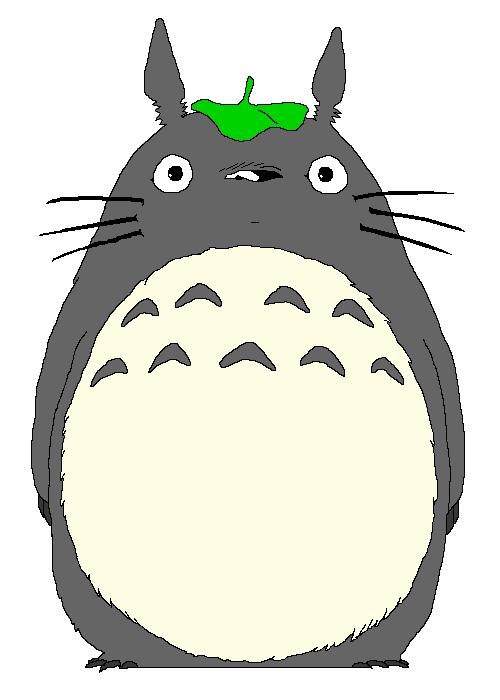

  <samp>
       
      Hi there! I'm <b>Kauã Thierry</b>
  </samp>

  

    
  
 

 
 

  

 

  

 
 

  

 
 

  
  

      <samp>
        <b>More Info</b>
      </samp>
  

  
   

  
  
   
   
  
   
   
  

 
  
  
  
  
  
  
  
  
  

 

##

 

  <samp>
    <b>Contact me:</b>
  </samp>
    

 

